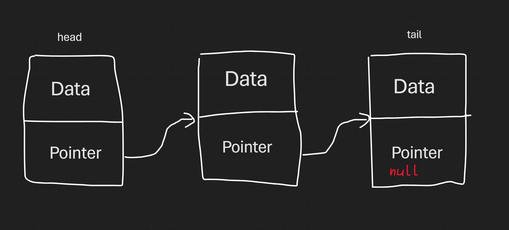
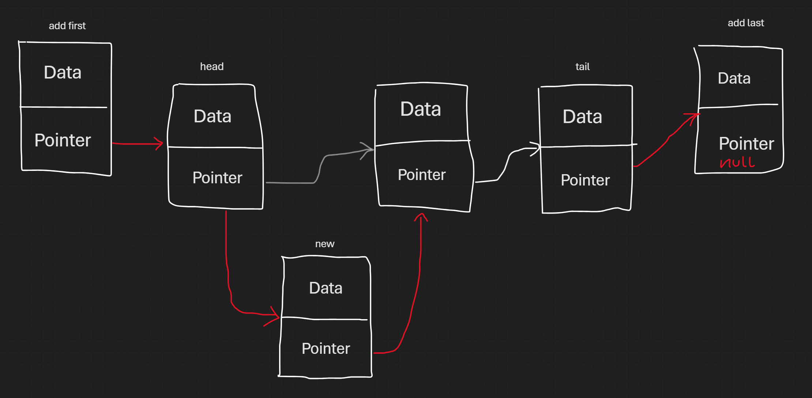
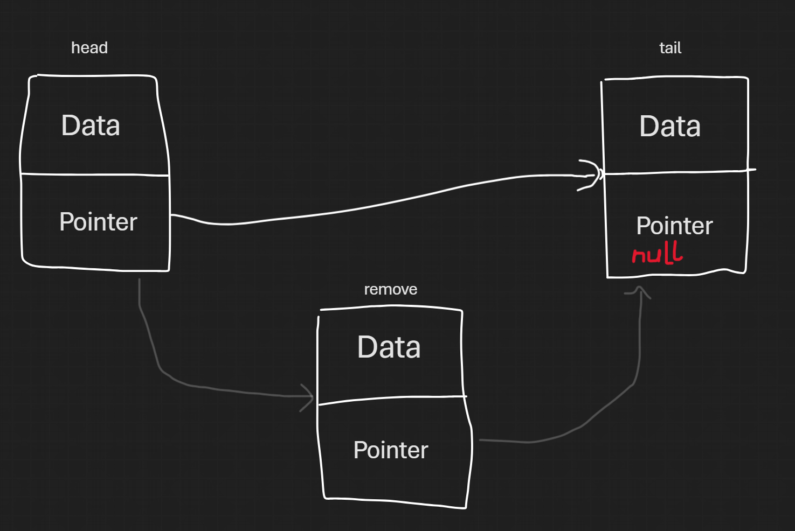
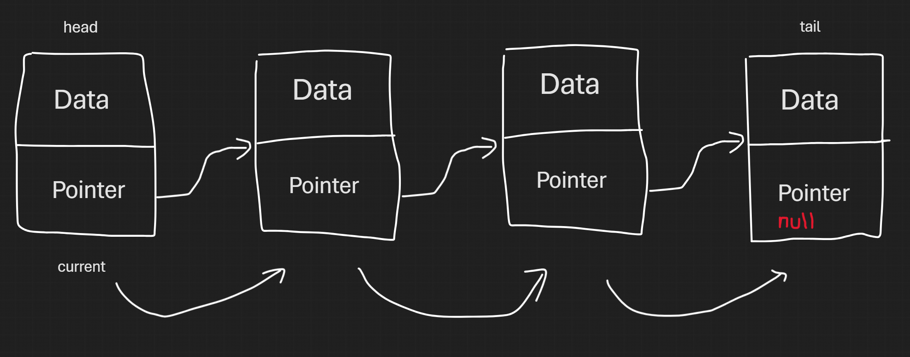

# Linked List

## Định nghĩa (Definition)
- Linked list là 1 cấu trúc dữ liệu tuyến tính (linear), khác với array là các phần tử được lưu liền kề thì ở linked list các phần tử được lưu ngẫu nhiên trên bộ nhớ và có các con trỏ (pointer) chỉ tới phần tử tiếp theo  
- Tưởng tượng bạn chơi truy tìm kho báu và tới vị trí này thì sẽ có địa chỉ cho vị trí tiếp theo và cứ như thế tương tự các vị trí tiếp theo. Bạn phải đi lần lượt từ đầu tiên tới cuối cùng mà không có nhảy cóc từ 2 -> 5 được
  
[Link](Wannapik Studio - https://www.wannapik.com/vectors/86545?search%5Bcategory_id%5D=3036&search%5Blicense_id%5D=2)  

## Cấu trúc (Structure)
  
- Linked list bao gồm các Node, mỗi Node sẽ có:  
+ Data: dữ liệu, có thể là int, float, string... hay là object  
+ Next: pointer chứa địa chỉ thằng tiếp theo trong danh sách  
- Linked list có chứa cả Head (quan trọng nhất, Node đầu tiên, mất là mất cả danh sách - Memory Leak) và Tail (Node cuối cùng, Next sẽ trỏ tới null)  
- Trong bộ nhớ thì mỗi Node sẽ nằm rải rác trong RAM, nối với nhau bởi pointer  

## Các thao tác cơ bản (Operations)
### 1. Chèn/Thêm (Add)
  

### 2. Xóa (Remove)
  

### 3. Lấy phần tử (Get)
  

### 4. Tìm kiếm (Search/Contains)

## Ứng dụng (Use cases)
- So sánh với Array (fixed kích thước) thì Linked list linh hoạt hơn, thao tác thêm/xóa ở đầu/cuối cực nhanh $O(1)$